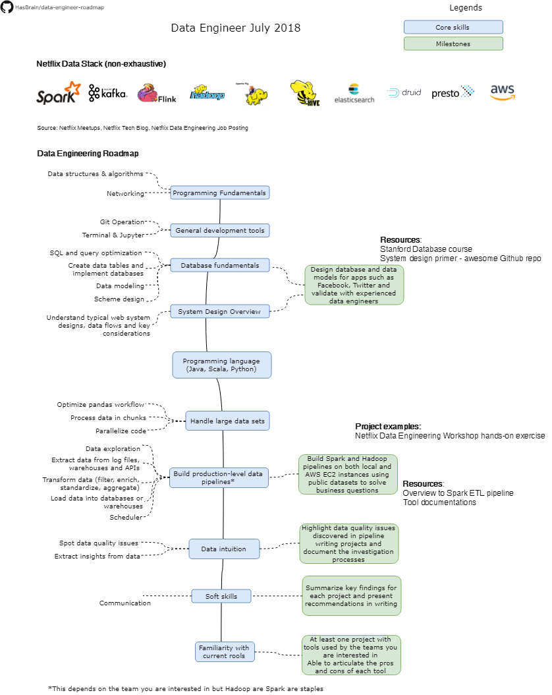

# Data Engineering Roadmap

Below you can find a chart demonstrating the paths that you can take and the milestones that you would want to achieve in order to become a data engineer. We spoke to senior data engineers and data engineering managers from top tech companies in the Silicon Valley, and consolidated learnings from these conversations and data engineering Meetups in the Bay Area. We hope this can serve as a guide to everyone interested in breaking into data engineering, especially people who do not live in close proximity to any tech hubs and don't have a strong personal network in data engineering.

We are continuing to add recommended resources, example practice projects and additional tips to expand the roadmap. Contributions are welcome and highly appreciated.

## Disclaimer
The purpose of this roadmap is to give you an overview of the core skills needed in data engineering. Any summary insights from conversations or Meetups does not represent any companies' opinion. Data engineering roles vary from one company to another, and from one role to another. If you are interested in a specific data engineering role, we recommend reaching out to individuals within the companies to talk about their roles and culture fit. If you found any insights that helped in your journey, the community will greatly benefit from your contributions.

## Roadmap

## Resources

### Netflix Hands-on Data Engineering Workshop (7/11/2018)
* Typical data engineering project at Netflix
    * Start with a problem statement
    * Data exploration
         * Data sources: logs, data warehouses, third party source API
         * Important to explore the structure, volume, granularity and frequency

    * Data modeling
        * Structure how the eventual output should look like
            * Depending on the consumer(direct end user vs. intermediate input to another system)
            * Depending on the skill level and preferred consumption mode of your consumer (can they parse JSon?)
        * Dimensionality
            * Time: day? Hour? Second? Roll up to what level?
            * Geography: region? Country? What insights are the stakeholders hoping to get out?
            * Device level? It is important because we want to optimize your experience)
        * Metrics
            * What do the stateholders want to measure?
            * Can I add more colors to help stakeholders diagnoze value drivers and extract deeper insights since I am the expert on data?
        * Relationships
            * Datasets have relationships with other entities (e.g. visitors to devices have many to many relationship)

    * Data transformation

        * Filter
        * Enrich the data to add more colors
        * Standarde (e.g. namiong convension)
        * Aggregate

    * Data quality
        * Check work thoroughly: look at trends, missing data gaps and anomalies

* Collaboration with other teams:
    * UI engineers: logging and instrumentation
    * Other data engineers
    * Data scientists and data analysts: understand their experiments and analysis to prepare data for insights
    * Data platform team: Considerations on efficiency and scalability

* Hands-on exercise: Build Spark pipeline following the above steps using Python
    * https://github.com/NFLX-WIBD/WIBD-Workshops-2018/tree/master/Data%20Engineering

### Conversation with Facebook senior data engineer
* Data engineers need to have strong fundamentals on relational database and data modeling. It is about problem solving so the more exposure you have, the larger your solution set it, the more likely you can come up with a good solution to address the requirements and constraints you face

### Presentation by Facebook data engineering manager: Role of a data engineer during a product launch
* Facebook data engineering team is diverse: people come from different backgrounds and bring in a rich set of unique perspectives
* Data engineers are embedded within product teams
* A product data engineer can empower the team to find product market fit and has significant influence on key metrics that the entire team should focus on driving. This requires one to have a strong product sense
* Example: On the product launch day, what should be on the dashboard?
    * How will you define active user events? How does it differ from a social media app, an e-commerce app to a B2B app?
    * What should be the cadence of measurement - daily, weekly, monthly, yearly?
    * We don't need to be hyper-focused on user acquisition funnels
    * We don't need to look at marketing conversion stats
    * We need to focus on retention. A product data engineer needs to advocate for that and not distract the team with too many secondary metrics
    * Tracking retention is first step, how can we improve retention? What data do I need to surface to the team to decide on the different drivers?
        * Cohort analysis

* Example: Launch day data infrastructure
    * validate logging, tie technical implementation to business metrics
    * Think about edge cases and use your business intuition to make decisions to how to handle these
        * If the sytem crashes during the startup process, should we still log it as an active event?
    * Optimize retention query
    * Provision for scalability

## License

